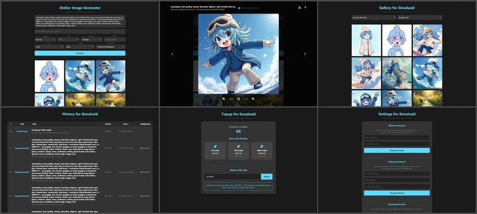

# Atelier Client Website
A hostable and comprehensive SaaS for Atelier clients.



## Tech Stack
- **Backend**: Python, Flask
- **Frontend**: React.js
- **Database**: SQLite

## Features
- User authentication and session management
- Image generation with SOTA Atelier models
- Credit system for service usage
- User gallery and history tracking
- Password recovery system
- Archive downloads for user galleries
- and more...

## Prerequisites
- Python 3.8+
- Internet connection

## Installation

1. Clone the repository:
```bash
git clone https://github.com/ikmalsaid/atelier-client-website.git
cd atelier-client-website
```

2. Create and activate a virtual environment:
```bash
python -m venv venv

# On Windows
venv\Scripts\activate

# On Unix or MacOS
source venv/bin/activate
```

3. Install Python dependencies:
```bash
pip install -r requirements.txt
```

## Required Python Packages
```txt
flask
flask-limiter
atelier-client
python-dateutil
```

## Running Locally

1. Start the Flask server:
```bash
python server.py
```

2. Access the application:
Open your web browser and navigate to `http://localhost:5000`

## Security Notes
- Default session lifetime is 1 hour
- Rate limiting is implemented on sensitive endpoints
- Password recovery system uses unique recovery keys
- All image processing is done server-side

## License
See [LICENSE](LICENSE) for more details.

## Contributing

We always welcome contributions to the Atelier Client Website! Here's how you can help:

### Getting Started
1. Fork the repository
2. Create a new branch for your feature (`git checkout -b feature/NewFeature`)
3. Commit your changes (`git commit -m 'Add some NewFeature'`)
4. Push to the branch (`git push origin feature/NewFeature`)
5. Open a Pull Request

For major changes, please open an issue first to discuss what you would like to change.
